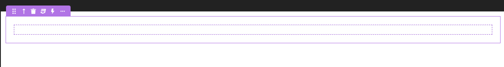
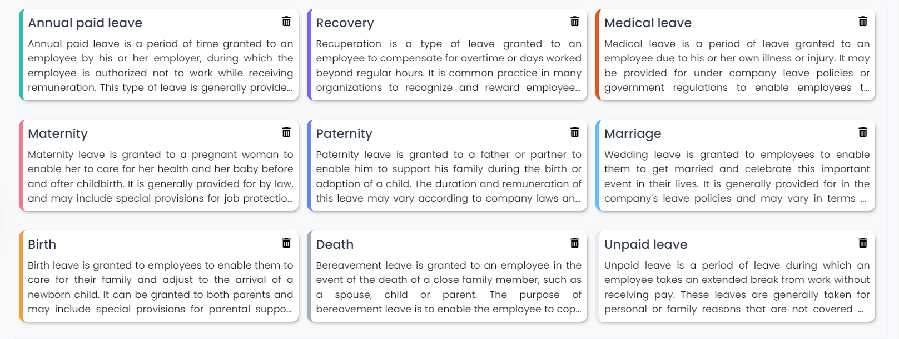
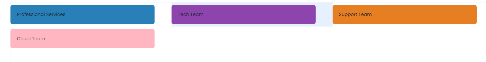
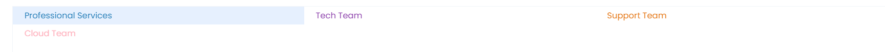

# Overview

**Stylish-Box** Component is an enhanced and dynamic Stylebox, it serves as a versatile container designed to enhance the capabilities of the Stylebox, by giving the developer the ability to apply an infinite number of css properties to the component.

# Stylish-Box Component



## Properties

| Name                | Type             | Description                                                                                                                             | Example                                  |
| ------------------- | ---------------- | --------------------------------------------------------------------------------------------------------------------------------------- | ---------------------------------------- |
| **Parameters**      | Array Of Objects | It's an array of **"CSS variables"**. Each object of the array contains the **name**, **value** and **default value** of the css class. |                                          |
| **`Name`**          | String           | It's the name of the css variable                                                                                                       | BgColor, fontSize, ...                   |
| **`Source`**        | Datasource       | It's the variable that contains the value of the css variable.                                                                          | `team.color`, `colorName`, `$this.color` |
| **`Default Value`** | String           | In case the `source` is empty, the default value will be applied.                                                                       | #6082B6, rgb(93, 63, 211), ...           |

## How it works

### Steps :

1. Drag and Drop the StylishBox component inside your page.
2. Add the Parameters property.
3. Add the **Name** (eg: `BgColor`), **Source** (eg: `team.color`) and default value (eg: `#6082B6`) of the css variable.
4. Select the stylebox inside the StylishBox component.
5. Create a css class :
   ```css
   .self {
     background-color: var(--BgColor);
   }
   ```

### Examples :

#### - Example 1

In this example we used a stylishbox inside a matrix to customize the border colors of the cells depending on the color attribute of each entity.



#### - Example 2

In this example we used a stylishbox inside a table to apply different background colors or font colors to the cells depending on the status attribute of each entity.




